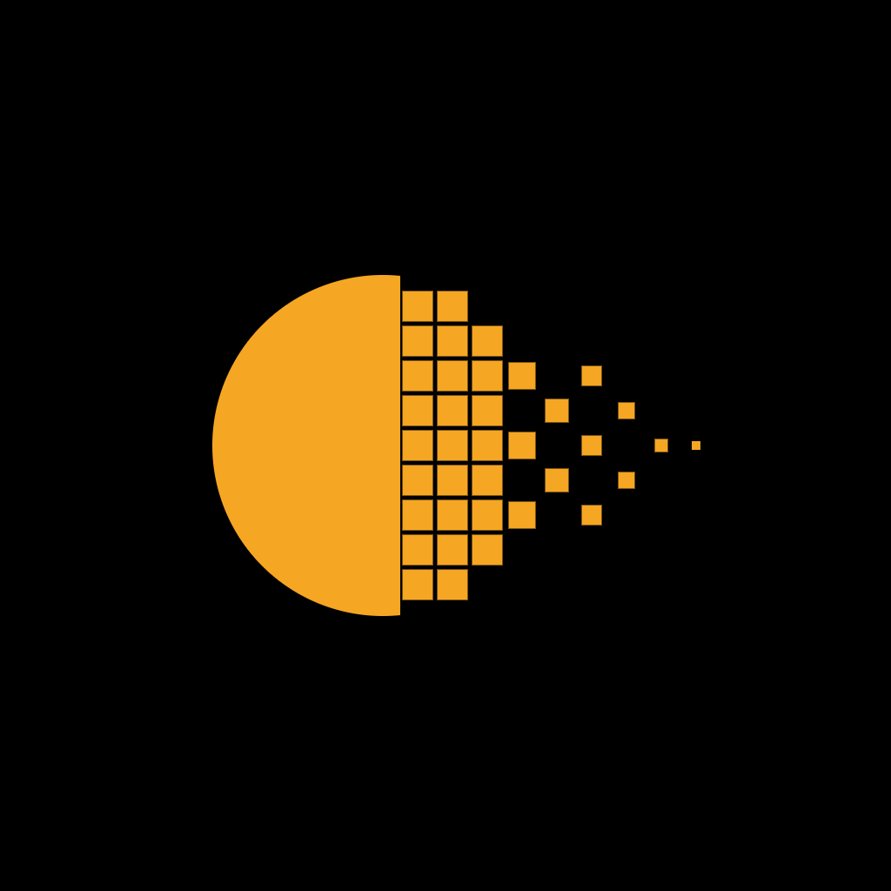

<p align="center">
  
</p>

<h1 align="center">dein.art</h1>

<p align="center">One place for creators to publish, go live, fund the next project and share the revenue with everyone who worked on it.</p>

<p align="center"><a href="https://dein-art.osmangulveren.workers.dev"><b>Open the live prototype →</b></a></p>

---

## What this is

dein.art is an idea for a blockchain-based home for creators. It starts with filmmakers and is meant for every kind of artist: musicians, illustrators, photographers, writers.

Today a creator needs one platform to publish, another to stream, another to share assets, another to raise funds, and a spreadsheet to pay the crew. dein.art brings these into one place:

- **Watch** — publish films and videos, free to watch
- **Live** — streaming with chat and tips
- **Marketplace** — footage, scripts, storyboards, templates and collectible scenes
- **Funding and merch** — on each creator's own page
- **Shared revenue** — every payment is split across cast and crew automatically
- **Credits** — every credit builds a page for the person behind it

The chain works in the background: who made what, who owns it, who gets paid. Creators and their audience should not have to think about it.

## Status

This is an early, side-project build, made in public a little at a time. Right now the repository holds a design prototype, not a working product.

The content in the prototype is real, so the pages can be judged with actual films, music and images in them:

- **Films** are public-domain works. 27 are hand-picked from Wikimedia Commons: Georges Méliès, F. W. Murnau, Dziga Vertov, Buster Keaton, Sergei Eisenstein, Lois Weber, Oscar Micheaux and others. About 25,000 more come from Wikimedia Commons and the Internet Archive: features, shorts, cartoons, newsreels, serials, early television, home movies, classroom and training films. They play in the page, and each film's page says why it is free to show. The weakest reason, "marked public domain at the Internet Archive by whoever put it there", is said in those words and comes with a link to report a mistake.
- **Credits** on film and artist pages come from Wikidata.
- **The marketplace** opens with about 30,000 free files: footage, music, sound effects, photographs and documents from Wikimedia Commons, CC0 sounds from Freesound, open-access art from the Cleveland Museum of Art, the National Gallery of Art and the Wellcome Collection, and public-domain books from Project Gutenberg. They are linked where they live, not copied.

- **Artists from the blockchain** sit alongside the others: real artists with CC0 collections on Ethereum, listed with the wallet that created the work. Their pages are unclaimed: the artists have not joined dein.art. A page is claimed from that wallet. Once the claims contract is deployed to the Sepolia testnet (`prototype/deploy.html`), the claim is a transaction there, public and the same for everyone, paid with free test ETH. Until then, the wallet signs a message that is checked in the browser. Any wallet also has a page at `artist.html?wallet=0x…` that its holder can claim.

Every entry links back to its source file. Public-domain and CC0 works are shown as free.

**What works for real**

- **Releasing a film.** A film (a file up to 25 MB, or a YouTube or Vimeo link) is stored with its people, their wallets and their shares, and gets its own page.
- **The split.** The film's maker records the split in `contracts/DeinArtSplits.sol` on Sepolia, Ethereum's test network. Support sent to the film is paid to each person in the same transaction, in their shares, minus one flat fee. The film page and the dashboard read the amounts back from the chain. Test ETH is free and worth nothing: the mechanism is real, the money is not.
- **Uploads** to the marketplace, **credits**, **page claims**, **view and download counts**, and the search.

**What is not real:** payments in real money, the earnings on the sample account, the split percentages shown on public-domain films, merch and funding campaigns. They show how the platform would work, and nothing is charged.

## What's in the repository

| Folder | Contents |
| --- | --- |
| [`prototype/`](prototype) | Clickable website design: static HTML, CSS and JavaScript, no build step. Live at [dein-art.osmangulveren.workers.dev](https://dein-art.osmangulveren.workers.dev) |
| [`brand/`](brand) | The emblem, as SVG and PNG |
| [`promo/`](promo) | The promo video ([watch](promo/dein-art-promo.mp4)) |
| [`worker/`](worker) | The Cloudflare worker: serves `prototype/` and keeps what everyone shares: view and download counts, page claims, uploaded files and the items made from them, credits, and the films creators release with their people and shares. Publishing needs a wallet sign-in; the worker checks the signature itself |
| [`contracts/`](contracts) | `DeinArtSplits.sol`: a film's support, split and paid out to its people in one transaction. `DeinArtClaims.sol`: page claims. Both for the Sepolia testnet, deployed from `prototype/deploy.html` |
| [`tools/contracts/`](tools/contracts) | Compiles the splits contract and tests it on a local chain |
| [`tools/qa/`](tools/qa) | Checks that open every page, click every control, and run the whole money path end to end on a local chain |
| [`tools/catalog/`](tools/catalog) | Scripts that build the demo catalogue from Wikimedia Commons, Wikidata and public on-chain records |

### Pages in the prototype

| Page | File |
| --- | --- |
| Home: what a creator can do here | `index.html` |
| The free library | `library.html` |
| About, what is real, and how to report something | `about.html` |
| Watch a film | `watch.html?f=…` |
| Live | `live.html` |
| Search results | `search.html` |
| Marketplace | `market.html` |
| Marketplace item | `item.html` |
| One NFT, read from the chain | `token.html` |
| Content category | `category.html` |
| Trending | `trending.html` |
| Creator page (videos, credits, collections, merch, funding) | `creator.html` |
| Artist page, the same tabbed layout for every artist; on-chain artists can claim theirs with a wallet signature | `artist.html?name=…` |
| Funding campaign | `fund.html` |
| Studios: film and music studios, DAOs, art studios, galleries | `studios.html`, `studio.html?s=…` |
| Publish flow | `upload.html` |
| Add a credit (form in five steps) | `add-credit.html` |
| A submitted title | `title.html` |
| Share an asset (form in four steps) | `share-asset.html` |

The content itself lives in `assets/catalog.js`, which is generated by the scripts in `tools/catalog`.

Light and dark themes are both included; the switch is in the header.

## Credits

Some interactive pieces (copy button, goo switch, chart card, delete button, heat slider, magnetic button, file upload) are recreated in plain JavaScript after components from [Devigner UI](https://ui.devigner.cc), which is MIT-licensed.

## Run it locally

```bash
git clone https://github.com/osmangulveren/dein-art.git
cd dein-art/prototype
python3 -m http.server 8000
```

Then open <http://localhost:8000>.

## The dot

The dot in the name is the symbol: a solid dot turning into blocks. Your work, going on record as yours.

## Follow along

Updates are posted on X at [@deindotart](https://x.com/deindotart).
